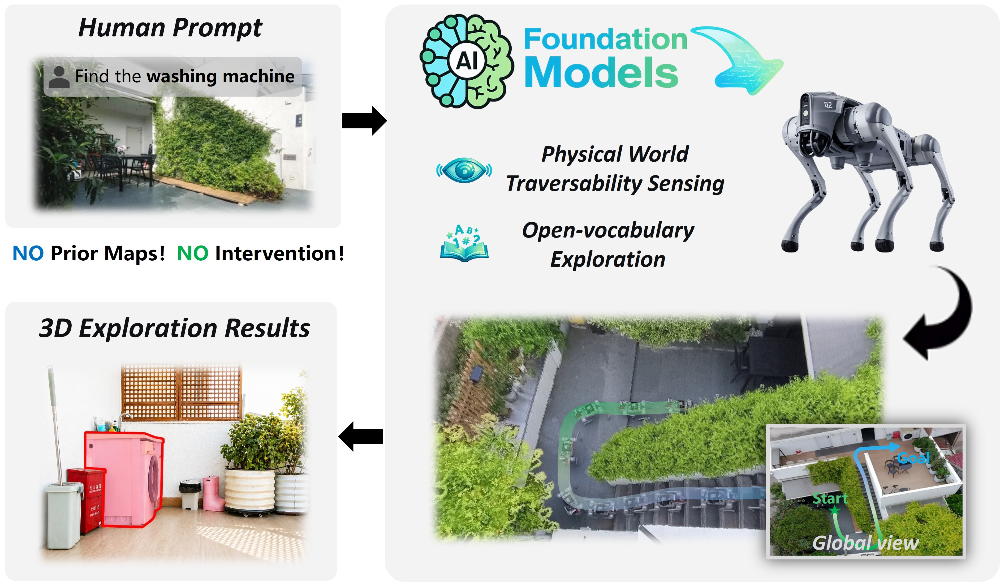
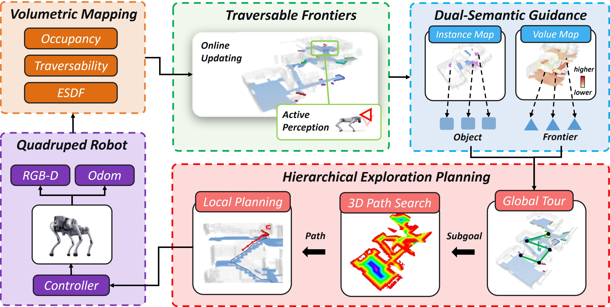
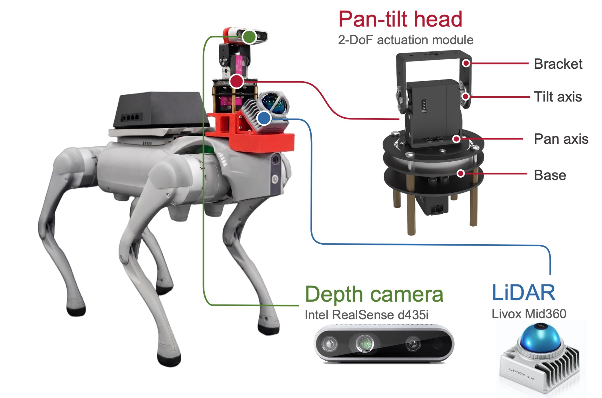
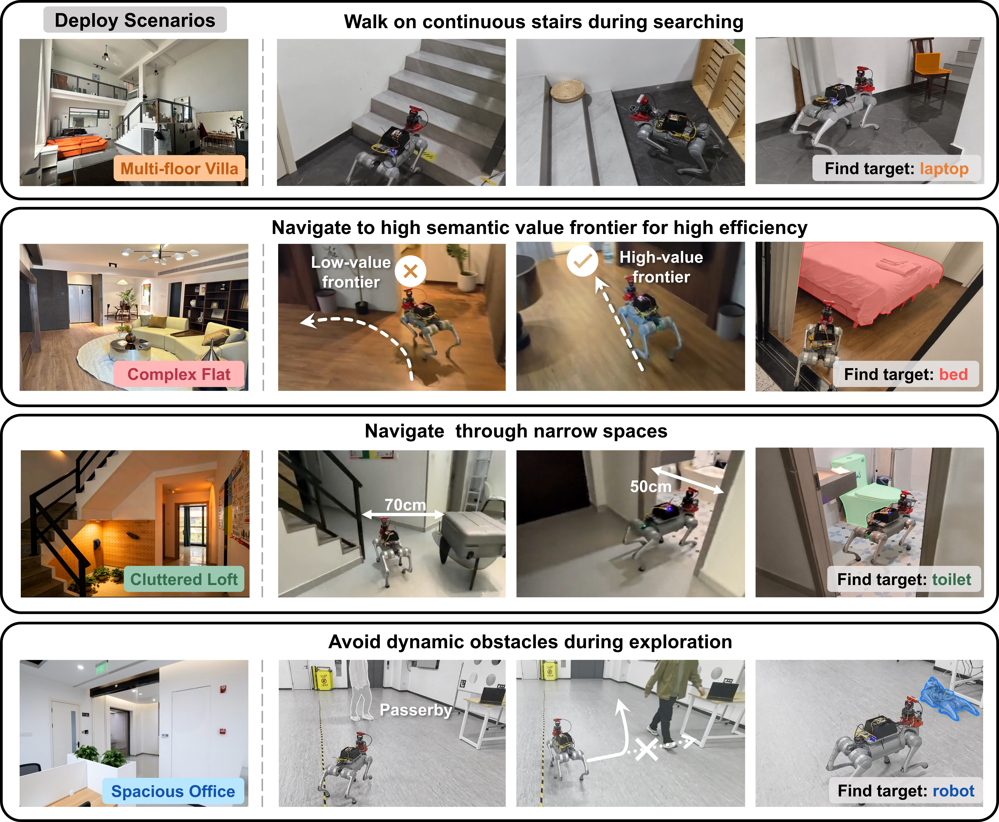

  <h1>
     TravExplorer
  </h1>
  <h2>Cross-Floor Embodied Exploration via Traversability-Aware 3D Planning</h2>
  

    <a href="https://wuyi2121.github.io/TravExplorer/" target="_blank">Han Zheng</a>1,
    <a href="https://wuyi2121.github.io/TravExplorer/" target="_blank">Zhe Chen</a>1,
    <a href="https://wuyi2121.github.io/TravExplorer/" target="_blank">Yudong Huang</a>1,
    <a href="https://wuyi2121.github.io/TravExplorer/" target="_blank">Haoran Liu</a>1,
    <a href="https://wuyi2121.github.io/TravExplorer/" target="_blank">Jinghao Wang</a>1,
    <a href="https://wuyi2121.github.io/TravExplorer/" target="_blank">Ming Yang</a>1,
    <a href="https://wuyi2121.github.io/TravExplorer/" target="_blank">Tong Qing</a>1 &nbsp; 
    1 Shanghai Jiao Tong University
  

  
  
  
   
  
<em>Code, paper, and citation information will be updated when they are publicly available.</em>

  

  TravExplorer is an embodied exploration system for quadruped robots that searches open-vocabulary targets across single-floor and cross-floor indoor scenes without prior maps.

## Highlights

- Traversability-aware 3D exploration for ground robots in stairs, narrow passages, cluttered rooms, and dynamic scenes.
- Open-vocabulary semantic guidance that steers exploration toward high-value frontiers for efficient target search.
- Hierarchical planning that combines traversable frontier selection, 3D path search, local planning, and active perception.
- Real-world validation on a quadruped platform with RGB-D, LiDAR, and a pan-tilt perception module.

## System Overview

  

## Robot Platform

  

## Real-World Experiments

  

More videos and interactive demonstrations are available on the <a href="https://wuyi2121.github.io/TravExplorer/" target="_blank">project page</a>.

## Release Status

- Project page: available.
- Code: pending public release.
- Paper and BibTeX: pending public release.

## Citation

Citation information will be added once the paper is available.
